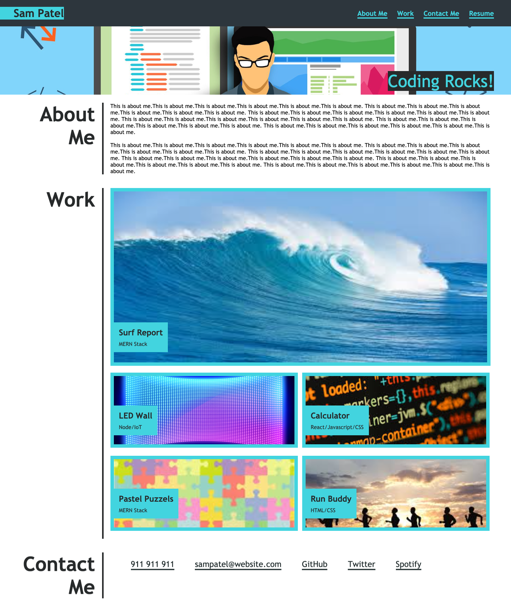

# Week-2-Homework - Professional Portfolio

Sam Patel portfolio page using HTML and CSS.

## Installation

- Git clone the application from : https://github.com/SamGTR/week-2-homework.git
- Navigate to the index.html.
- Open the index.html file with any web browser.

## Description

This project is about creating a portfolio page from scratch. The web application layout is kept simple. The header section contains my full name and links to various sections of the webpage. By clicking the links in the header section, you can directly navigate to that particular section.    

- The first section "About Me" provides information about myself. This is just a trial page so no actual information about me is added.  

- The second section "Work" shows detail about the web applications created my me and the links to them.  
The images are embedded with links to a about me webpage created by me. The images are highlighted when the mouse cursor hovers over them.  

- The third section "Contact Me" provides various means to contact me. As of now, these all contact means are kept clickable but no actual anchor link is provided. 

- The web page is designed using responsive layout, hence the sections of the page would adjust to the viewport when the window size is reduced to smaller resolution.

## Technology

The web application is developed using HTML and CSS files. The CSS file includes features like media query, flexbox etc. The images on the webpage are located in images folder.

## Screenshot

Below is the screenshot of the Horiseon web application after refactoring completed:

## Links

Following is the link to the Sam Patel's Portfolio web application:  
https://samgtr.github.io/week-2-homework/ 

Following is the link to the Github repository:  
https://github.com/SamGTR/week-2-homework

## License

MIT